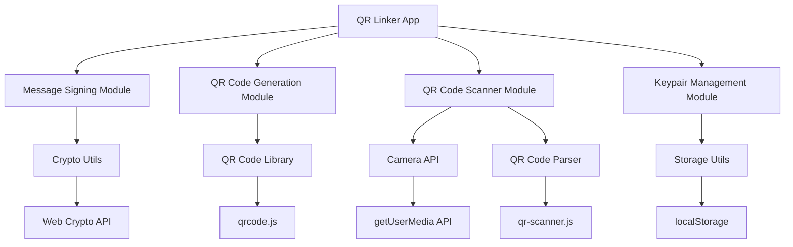
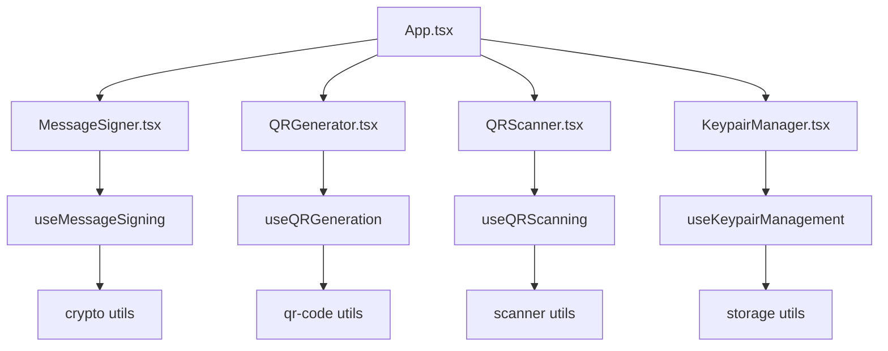

# Design Document

## Overview

The QR Linker microapp is a React-based web application that enables secure message signing and verification through QR codes. It leverages Ed25519 cryptography for digital signatures and provides a seamless offline experience for cross-device communication. The app integrates with the existing Key Generator infrastructure to reuse keypairs and extends functionality with message signing, QR code generation, and camera-based scanning capabilities.

## Trust Model

The QR Linker operates on a decentralized trust model with the following key principles:

- **Manual Trust Establishment**: Trust is established manually by pre-sharing public keys between parties. Users must obtain and verify public keys through out-of-band channels.

- **No Centralized Registry**: This app assumes signer identity is known by verifying the public key. There is no centralized certificate authority or identity registry.

- **Key-Based Identity**: Identity verification relies solely on possession of the corresponding private key. The public key serves as the identifier, and successful signature verification proves the signer had access to the matching private key.

- **User Responsibility**: Users are responsible for:

  - Securely sharing their public keys with intended recipients
  - Verifying the authenticity of public keys they receive
  - Understanding that signature verification only proves key possession, not real-world identity

- **Trust Scope**: A valid signature only proves that:
  - The message was signed by someone with access to the private key
  - The message has not been tampered with since signing
  - The signature was created using the claimed public key

This model is suitable for scenarios where participants can establish trust relationships directly, such as within teams, organizations, or between known parties.

## Architecture

### High-Level Architecture



### Component Architecture



## Components and Interfaces

### Core Components

#### 1. MessageSigner Component

- **Purpose**: Handles message input and signing operations
- **Props**:
  - `onMessageSigned: (signedData: SignedMessage) => void`
  - `keypair?: CryptoKeyPair`
- **State**: message text, signing status, error states
- **Key Features**: Text input, sign button, signature display

#### 2. QRGenerator Component

- **Purpose**: Generates and displays QR codes from signed messages
- **Props**:
  - `signedMessage: SignedMessage`
  - `onQRGenerated?: (qrDataUrl: string) => void`
- **State**: QR code data URL, generation status
- **Key Features**: QR code display, download/print options

#### 3. QRScanner Component

- **Purpose**: Scans QR codes and verifies signatures
- **Props**:
  - `onMessageVerified: (verificationResult: VerificationResult) => void`
  - `onScanError?: (error: Error) => void`
- **State**: camera status, scanning status, permissions
- **Key Features**: Camera preview, scan detection, manual input fallback

#### 4. KeypairManager Component

- **Purpose**: Manages keypair operations and display
- **Props**: None (self-contained)
- **State**: keypair status, public key display
- **Key Features**: Keypair generation, import, display, clear

### Data Models

#### SignedMessage Interface

```typescript
interface SignedMessage {
  message: string;
  signature: string; // Base64 encoded
  publicKey: string; // Base64 encoded
  timestamp: number;
  algorithm: 'Ed25519';
}
```

#### QRCodeData Interface

```typescript
interface QRCodeData {
  version: string; // Format version for future compatibility
  data: SignedMessage;
}
```

#### VerificationResult Interface

```typescript
interface VerificationResult {
  isValid: boolean;
  message: string;
  signerPublicKey: string;
  timestamp?: number;
  error?: string;
}
```

### Custom Hooks

#### useMessageSigning Hook

```typescript
interface UseMessageSigningReturn {
  signMessage: (message: string) => Promise<SignedMessage>;
  isLoading: boolean;
  error: string | null;
  clearError: () => void;
}
```

#### useQRGeneration Hook

```typescript
interface UseQRGenerationReturn {
  generateQR: (data: SignedMessage) => Promise<string>;
  qrDataUrl: string | null;
  isGenerating: boolean;
  error: string | null;
}
```

#### useQRScanning Hook

```typescript
interface UseQRScanningReturn {
  startScanning: () => Promise<void>;
  stopScanning: () => void;
  verifyScannedData: (qrData: string) => Promise<VerificationResult>;
  isScanning: boolean;
  hasPermission: boolean;
  error: string | null;
}
```

## Data Models

### Message Signing Flow

1. User inputs message text
2. System validates message (non-empty, reasonable length)
3. System retrieves private key from storage
4. System generates Ed25519 signature using Web Crypto API
5. System creates SignedMessage object with metadata
6. System returns signed message for QR generation

### QR Code Generation Flow

1. System receives SignedMessage object
2. System creates QRCodeData wrapper with version info
3. System serializes data to JSON string
4. System validates JSON size against QR code capacity limits
5. System generates QR code using qrcode.js library
6. System returns data URL for display/download

### QR Code Scanning Flow

1. System requests camera permissions
2. System initializes camera stream and QR scanner
3. System continuously scans for QR codes
4. On detection, system parses QR data as JSON
5. System validates data structure and extracts SignedMessage
6. System verifies signature using extracted public key
7. System returns VerificationResult with status and details

## Error Handling

### Error Categories

#### 1. Cryptographic Errors

- **UnsupportedBrowserError**: Browser lacks Web Crypto API or Ed25519 support
- **KeyGenerationError**: Keypair generation failures
- **SigningError**: Message signing failures
- **VerificationError**: Signature verification failures

#### 2. Storage Errors

- **StorageUnavailableError**: localStorage not available
- **DataIntegrityError**: Corrupted stored data
- **StorageError**: General storage operation failures

#### 3. QR Code Errors

- **QRGenerationError**: QR code creation failures
- **QRScanError**: QR code scanning failures
- **DataSizeError**: Message too large for QR code
- **InvalidQRDataError**: Malformed QR code data

#### 4. Camera/Permission Errors

- **CameraPermissionError**: Camera access denied
- **CameraUnavailableError**: No camera device available
- **CameraError**: General camera operation failures

### Error Handling Strategy

#### User-Friendly Error Messages

- Display clear, actionable error messages
- Provide fallback options when possible
- Include troubleshooting suggestions
- Avoid exposing technical implementation details

#### Graceful Degradation

- Manual QR data input when camera fails
- Keypair generation when import fails
- Alternative browsers suggestions for unsupported features

#### Error Recovery

- Automatic retry mechanisms for transient failures
- Clear error state reset options
- Guided recovery workflows
- Persistent error logging for debugging

## Testing Strategy

### Unit Testing

#### Crypto Operations Testing

- Test message signing with various input sizes
- Test signature verification with valid/invalid signatures
- Test keypair generation and import/export
- Test error handling for unsupported browsers
- Mock Web Crypto API for consistent testing

#### QR Code Operations Testing

- Test QR generation with various message sizes
- Test QR parsing with valid/invalid data
- Test data serialization/deserialization
- Test size limit validation
- Mock QR libraries for predictable results

#### Storage Operations Testing

- Test keypair save/load operations
- Test storage error scenarios
- Test data integrity validation
- Test secure clearing operations
- Mock localStorage for controlled testing

### Integration Testing

#### End-to-End Workflows

- Complete sign → generate QR → scan → verify workflow
- Cross-device verification scenarios
- Error recovery workflows
- Browser compatibility testing

#### Component Integration

- Message signer to QR generator integration
- QR scanner to verification integration
- Keypair manager to signing integration
- Error boundary integration
- State management integration

### Browser Compatibility Testing

#### Target Browsers

- Chrome 93+ (Ed25519 support)
- Firefox 102+ (Ed25519 support)
- Safari 16+ (Ed25519 support)
- Edge 93+ (Ed25519 support)

#### Feature Detection Testing

- Web Crypto API availability
- Ed25519 algorithm support
- Camera API support
- localStorage availability
- QR code library compatibility

### Security Testing

#### Cryptographic Security

- Signature verification accuracy
- Key generation randomness
- Secure key storage practices
- Memory cleanup after operations
- Side-channel attack resistance

#### Data Security

- QR code data integrity
- Storage encryption considerations
- Secure data transmission
- Privacy protection measures
- Audit trail maintenance

### Performance Testing

#### QR Code Performance

- Generation time for various message sizes
- Scanning accuracy and speed
- Memory usage during operations
- Battery impact on mobile devices
- Camera resource management

#### Crypto Performance

- Signing operation latency
- Verification operation latency
- Key generation time
- Memory usage patterns
- CPU utilization monitoring
